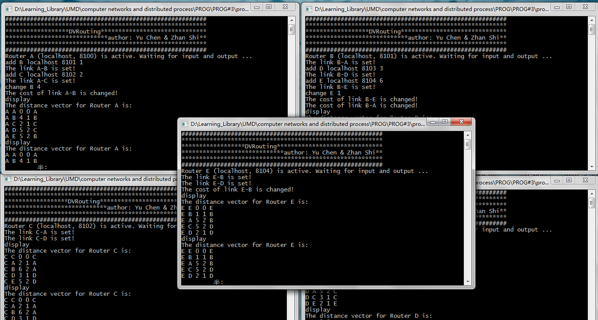

<h3>

=====================================================================

                                                                        
                              
======
                                    
                              
README
                                    
                              
======</>                                    
                                                                        
                             
DVRouting 1.0
 
                             
26 Nov. 2014
 
                             
author: Hugo Chan
 
                           
                      
C++ Programs for Socket Programming
  
                 																			                                               

=====================================================================
 
</h3>

<h3>
<a name="Contents" class="anchor" href="#Contents"></a>Contents</h3>
<ul class="task-list">
<li>
1. Description
</li>
<li>
2. Implementation
</li>
<li>
3. Operation Instruction
</li>
<li>
4. Notice
</li>
<li>
5. Screenshot
</li>
</ul>

<h3>
<a name="Description" class="anchor" href="#Description"></a>1. Description</h3>
<ul class="task-list">
<li>
A distance vector routing protocol that implements the distributed Bellman-Ford algorithm.
</li>
<li>
Triggered update and poison reverse features are incorporated.
</li>
<li>
 The program runs on Windows.
</li>
<li>
 Each process simulates a router.
</li>
</ul>

<h3>
<a name="Implementation" class="anchor" href="#Implementation"></a>2. Implementation</h3>
<ul class="task-list">
<li>
 An interactive console is implemented for interaction.
</li>
<li>
 Sub-thread is responsible to run a distance vector protocol.
</li>
<li>
 Router information (e.g., ID, hostname, portnum, sock, life_state and link_info) is maintained by corresponding router.
</li>
<li>
 Routing table is maintained by corresponding router.
</li>
<li>
 Timeout information for each link is maintained by corresponding router.
</li>
</ul>

<h3>
<a name="Operation Instruction" class="anchor" href="#Operation_Instruction"></a>3. Operation Instruction</h3>
<ul class="task-list">
<li>
 Using cmd to run the exe file, and router ID & port number should be passed to it. (format: DVRouting RID portnum)
</li>
<li>
 For each router, using command: add RID IP portnum distance to add a link between current router and the specific router whose ID is RID.
</li>
<li>
 For each router, using command: change RID distance to change the link between current router and the specific router whose ID is RID.
</li>
<li>
 For each router, using command: display to print out its routing table.
</li>
<li>
 For each router, using command: kill to kill the router.
</li>
<li>
 Comment the #define _POISONREVERSE in source code DVRouting.cpp to cancel the poison reverse feature.
</li>
</ul>

<h3>
<a name="Notice" class="anchor" href="#Notice"></a>4. Notice</h3>
<ul class="task-list">
<li>
 Current version only supports localhost (loopback) IP address.
</li>
</ul>

<h3>
	
5. Screenshot
</h3>
&nbsp;&nbsp;&nbsp;&nbsp;</img>